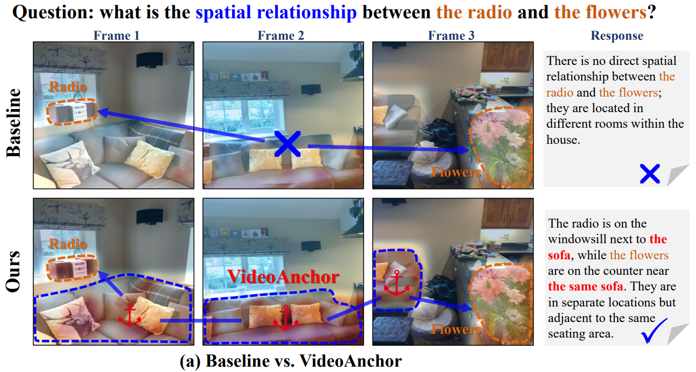

<div align="center">
<h3><a href="https://www.arxiv.org/abs/2509.25151">
VideoAnchor: <br>
Reinforcing Subspace-Structured Visual Cues for Coherent Visual-Spatial Reasoning
</a></h3>
<h3>(Accepted by ICLR 2026)</h3>

[ZhaoZhi Wang](https://feufhd.github.io/ZhaozhiWang/)<sup>1,2</sup>, [Tong Zhang](https://sites.google.com/view/tong-zhang)<sup>1</sup>, [Mingyue Guo](https://csguomy.github.io/)<sup>2</sup>, [Yaowei Wang](https://scholar.google.com.hk/citations?user=o_DllmIAAAAJ&hl=zh-CN&oi=ao)<sup>2</sup>, [Qixiang Ye](https://people.ucas.ac.cn/~0007279?language=en)<sup>1,2</sup>

<sup>1</sup> University of Chinese Academy of Sciences, <sup>2</sup> Peng Cheng Laboratory

</div>

## Abstract

Multimodal Large Language Models (MLLMs) have achieved impressive progress in vision–language alignment, yet they remain limited in visual–spatial reasoning. We first identify that this limitation arises from the attention mechanism: visual tokens are overshadowed by language tokens, preventing the model from consistently recognizing the same visual cues across frames. To address this challenge, we draw a novel connection between the self-expressiveness property in sparse subspace clustering and the attention mechanism in Transformers. Building on this insight, we propose VideoAnchor, a plug-and-play module that leverages subspace affinities to reinforce visual cues across frames without retraining, effectively anchoring attention to shared visual structures. Extensive experiments across benchmarks and backbone models show consistent performance gains — e.g., 3.2% and 4.6% improvements on VSI-Bench and Video-MME (spatial-related tasks) with InternVL2-8B and Qwen2.5VL-72B—while qualitative analyses demonstrate more coherent subspace partitions and stronger visual grounding.

<div style="width:70%; margin: 0 auto; text-align: left;">
  
  <p>
    <em>
      Effect of the proposed VideoAnchor. Attention activations over shared regions (e.g., the sofa) across frames show how consistent patterns are anchored to enhance visual-spatial reasoning, enabling more precise object co-location and contextual proximity than InternVL2-8B (baseline).
    </em>
  </p>
</div>

## Getting Started

Please follow the steps below to set up the environment and integrate VideoAnchor for VSI-Bench evaluation:

- **Environment Setup**  
   Refer to the [thinking-in-space repository](https://github.com/vision-x-nyu/thinking-in-space) and [SSC-Py-CUDA](https://github.com/XHMY/SSC-Py-CUDA) for environment installation instructions, which we gratefully acknowledge. 

- **Install SSC**  
   ```bash
   cd SSC-Py-CUDA
   pip install -e .
   cd ..
   ```

### 3. Integrate Model Wrappers

To unify the evaluation interface and align with the `lmms_eval` framwork, please relocate the following files:

- **Core entry & API**
  - Move `lmms_eval_general/__main__.py` → `lmms_eval/__main__.py`
  - Move `lmms_eval_general/task.py` → `lmms_eval/api/task.py`

- **Model wrappers**

  Move the following model wrapper implementations into the `lmms_eval/models/` directory:
  - `internvl2/internvl2.py`
  - `llava_video/llava_vid.py`
  - `qwen2.5vl/qwen2_5_vl.py`


4. **Update Dependencies**  
   Move other model files to the right places in *transformers* or the model folder.

5. **Evaluation**  
   Refer to the [thinking-in-space repository](https://github.com/vision-x-nyu/thinking-in-space) for the evaluation.

***We will release the code of VideoAnchor implementation with [FlashBias](https://github.com/thuml/FlashBias) recently.***

<p style="font-size: 1.2em;">
  <strong>
    Please e-mail <a href="mailto:wangzhaozhi22@mails.ucas.ac.cn">me</a> if you have any questions!
  </strong>
</p>

## Citation
```
@article{wang2025videoanchor,
  title={VideoAnchor: Reinforcing Subspace-Structured Visual Cues for Coherent Visual-Spatial Reasoning},
  author={Wang, Zhaozhi and Zhang, Tong and Guo, Mingyue and Wang, Yaowei and Ye, Qixiang},
  journal={arXiv preprint arXiv:2509.25151},
  year={2025}
}
```
